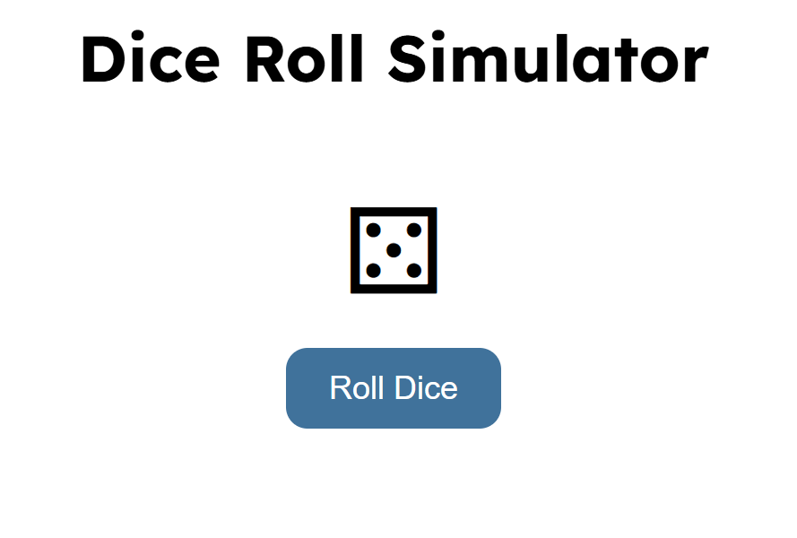
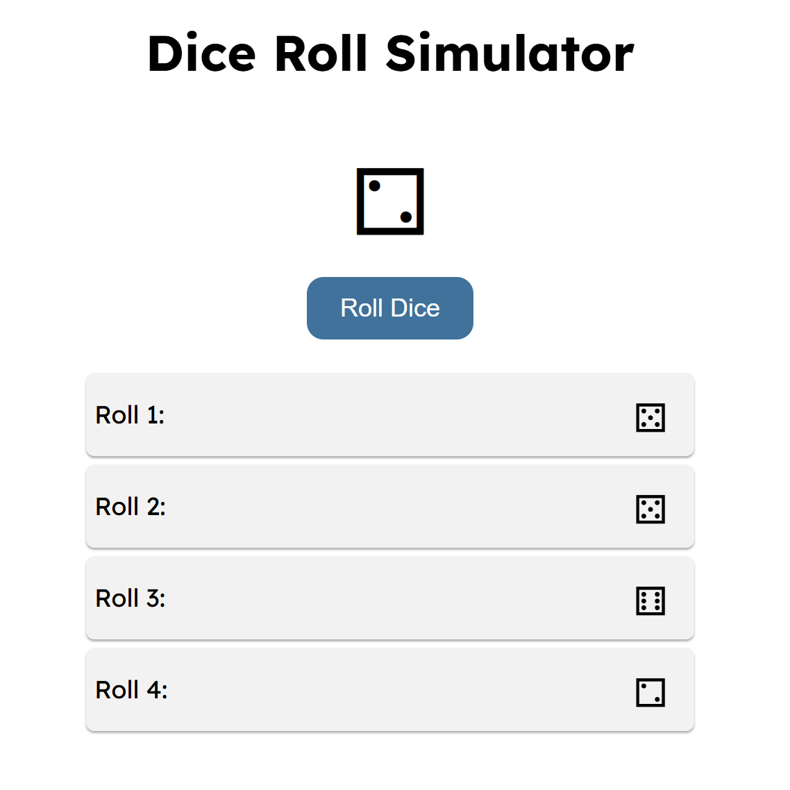

# Dice Roll Simulator

A fun and interactive **Dice Roll Simulator** built with HTML, CSS, and JavaScript. Users can roll a dice, see the dice face animate, and keep track of their roll history.

---

## Demo

Here’s how the Dice Roll Simulator looks:





---

## Features

- Roll a six-sided dice with a single click.  
- Animated dice rotation for a realistic rolling effect.  
- Displays the result using dice Unicode characters.  
- Tracks all previous rolls in a history list.  
- Responsive and visually appealing design.  

---

## Technologies Used

- HTML5  
- CSS3 (with Google Fonts)  
- JavaScript (ES6)

---

## How It Works

1. User clicks the **Roll Dice** button.  
2. JavaScript generates a random number between 1 and 6.  
3. The dice face updates using Unicode dice characters (`&#9856;` to `&#9861;`).  
4. Dice animation plays while rolling.  
5. Each roll is recorded and displayed in the roll history list below the dice.

---

## Installation

1. Clone the repository:
```bash
git clone https://github.com/Ritupagar12/dice-roll-simulator.git
```
2. Navigate to the project folder:
```bash
cd dice-roll-simulator
```
3. Open index.html in your web browser.
